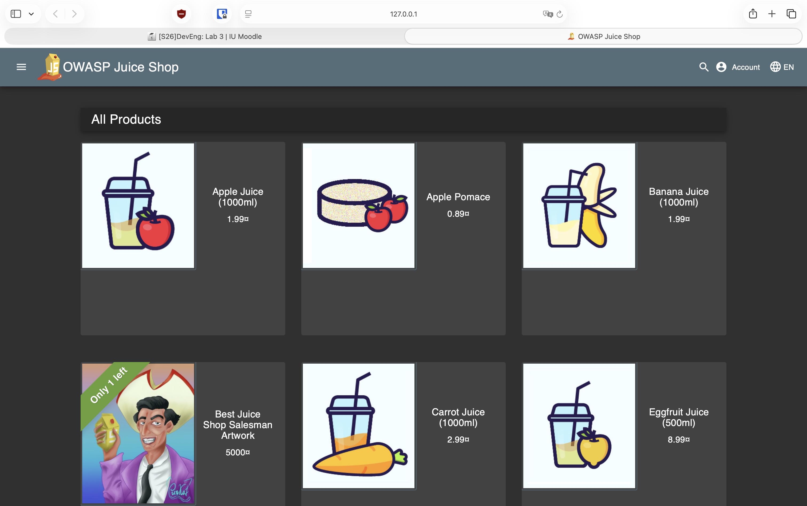

# Triage Report — OWASP Juice Shop

## Scope & Asset

- **Asset**: OWASP Juice Shop (local lab instance)
- **Image**: `bkimminich/juice-shop:v19.0.0`
- **Image Digest**: `sha256:2765a26de7647609099a338d5b7f61085d95903c8703bb70f03fcc4b12f0818d`
- **Release Link**: https://github.com/juice-shop/juice-shop/releases/tag/v19.0.0
- **Release Date**: March 2024

## Environment

- **Host OS**: macOS 14.5 (Darwin 25.2.0)
- **Architecture**: arm64 (Apple Silicon)
- **Docker Version**: 28.3.3
- **Docker Desktop**: Running on macOS

## Deployment Details

- **Run Command Used**:
  ```bash
  docker run -d --name juice-shop \
    -p 127.0.0.1:3000:3000 \
    bkimminich/juice-shop:v19.0.0
  ```
- **Access URL**: http://127.0.0.1:3000
- **Container ID**: `a7fdb6b16f05e21ebbbe6f5a6463f4bbc0af1a433017065fe6109dd18c7e48c3`
- **Network Exposure**: 127.0.0.1 only ✅ — Bound to localhost only, not exposed to external network

## Health Check

### Page Load



The OWASP Juice Shop homepage loads successfully displaying:
- OWASP Juice Shop branding and logo
- Product listings (Apple Juice, Orange Juice, etc.)
- Navigation menu with Account, Basket, and Search
- Login and Registration options

### API Check


```bash
$ curl -s http://127.0.0.1:3000/api/Products | head -c 500
```

**Output:**
```json
{"status":"success","data":[{"id":1,"name":"Apple Juice (1000ml)","description":"The all-time classic.","price":1.99,"deluxePrice":0.99,"image":"apple_juice.jpg","createdAt":"2026-02-09T12:41:36.390Z","updatedAt":"2026-02-09T12:41:36.390Z","deletedAt":null},{"id":2,"name":"Orange Juice (1000ml)","description":"Made from oranges hand-picked by Uncle Dittmeyer.","price":2.99,"deluxePrice":2.49,"image":"orange_juice.jpg","createdAt":"2026-02-09T12:41:36.390Z","updatedAt":"2026-02-09T12:41:36.390Z",...
```

**Status**: ✅ API responds successfully with `{"status":"success"}` and product data

### Security Headers Analysis

```bash
$ curl -I http://127.0.0.1:3000
```

**Headers Present:**
- `X-Content-Type-Options: nosniff` ✅
- `X-Frame-Options: SAMEORIGIN` ✅
- `Feature-Policy: payment 'self'` ✅
- `Access-Control-Allow-Origin: *` ⚠️ (Permissive CORS)

**Headers Missing:**
- `Content-Security-Policy` ❌ (Missing CSP increases XSS risk)
- `Strict-Transport-Security` ❌ (No HSTS for HTTPS enforcement)

## Surface Snapshot (Triage)

| Area | Status | Notes |
|------|--------|-------|
| **Login/Registration visible** | ✅ Yes | Login form and registration link clearly visible in navigation |
| **Product listing/search present** | ✅ Yes | Products displayed on homepage with search functionality |
| **Admin or account area discoverable** | ✅ Yes | Account menu accessible, admin endpoints potentially discoverable |
| **Client-side errors in console** | ❌ No | No obvious JavaScript errors in initial page load |
| **Security headers** | ⚠️ Partial | Some headers present, but CSP and HSTS missing |

## Risks Observed (Top 3)

Based on the OWASP Top 10 (2021) and lecture content (lec1.md):

### 1. Broken Authentication (OWASP A07:2021)

OWASP Juice Shop intentionally includes weak authentication mechanisms for training purposes. The application is designed to contain authentication vulnerabilities that allow students to practice:
- Bypassing login screens
- Privilege escalation attacks
- Session manipulation

**Evidence**: Application includes multiple login challenges and intentionally vulnerable authentication flows as part of its educational design.

### 2. Missing Security Headers (OWASP A05:2021 - Security Misconfiguration)

The absence of Content-Security-Policy (CSP) and Strict-Transport-Security (HSTS) headers increases vulnerability to:
- Cross-Site Scripting (XSS) attacks without CSP restrictions
- Man-in-the-middle attacks without HSTS enforcement

**Evidence**: Security headers check shows missing CSP and HSTS headers while some protective headers (X-Frame-Options, X-Content-Type-Options) are present.

### 3. Sensitive Data Exposure (OWASP A02:2021 - Cryptographic Failures)

The API endpoint `/api/Products` exposes extensive internal application data including:
- Database timestamps (`createdAt`, `updatedAt`)
- Internal field names and structure
- Potential soft-delete indicators (`deletedAt` field)

**Evidence**: API response reveals internal database schema and temporal data that could aid reconnaissance efforts.

---

## PR Template Setup

### Template Created

Created `.github/pull_request_template.md` with the following structure:

```markdown
## Goal
<!-- Briefly describe the goal of this pull request -->

## Changes
<!-- List the main changes made in this PR -->

## Testing
<!-- Describe how you tested the changes -->

## Artifacts & Screenshots
<!-- Include relevant artifacts, screenshots, or evidence -->

---

## Checklist
- [ ] Clear title following conventional commits
- [ ] Documentation updated if needed
- [ ] No secrets or large temporary files included
```

### Verification

The PR template was created to:
1. **Standardize submissions** - Every lab PR will have consistent sections
2. **Improve readability** - Reviewers can quickly find goals, changes, and evidence
3. **Ensure quality** - Checklist prevents common mistakes (secrets, unclear titles)

### How Templates Improve Collaboration

PR templates enhance workflow by:
- **Reducing review friction** - Reviewers know exactly where to look for information
- **Setting expectations** - Contributors understand what documentation is required
- **Preventing incomplete submissions** - Checklist catches missing items before PR creation
- **Enabling consistent documentation** - All PRs follow the same structure for future reference

---

## GitHub Community Engagement

### Why Starring Repositories Matters

Starring repositories serves multiple purposes in open source:

1. **Discovery & Bookmarking** - Stars help you bookmark interesting projects for later reference and appear in your GitHub profile, showing your technical interests to potential employers.

2. **Project Visibility** - Star count indicates project popularity and community trust. High star counts help projects gain visibility in GitHub search and recommendations.

3. **Supporting Open Source** - Stars encourage maintainers by showing appreciation for their work and help attract more contributors to the project.

### Why Following Developers Matters

Following developers supports professional growth:

1. **Networking** - See what other developers are working on and build professional connections beyond the classroom.

2. **Learning** - Learn from others' code, commits, and how experienced developers solve problems.

3. **Collaboration** - Stay updated on classmates' work, making it easier to find team members for future projects and build a supportive learning community.

4. **Career Growth** - Follow thought leaders in your technology stack to see trending projects and build visibility in the developer community.

### Actions Completed

- ⭐ Starred course repository (DevSecOps-Intro)
- ⭐ Starred simple-container-com/api project: https://github.com/simple-container-com/api
- 👤 Following @Cre-eD (Professor)
- 👤 Following @marat-biriushev (TA)
- 👤 Following @pierrepicaud (TA)
- 👤 Followed 3+ classmates from the course

---

## References

- OWASP Juice Shop Documentation: https://owasp.org/www-project-juice-shop/
- OWASP Top 10 (2021): https://owasp.org/www-project-top-ten/
- Lecture 1 - DevSecOps Foundations & Secure SDLC: `/lectures/lec1.md`
- Lab 1 Requirements: `/labs/lab1.md`
